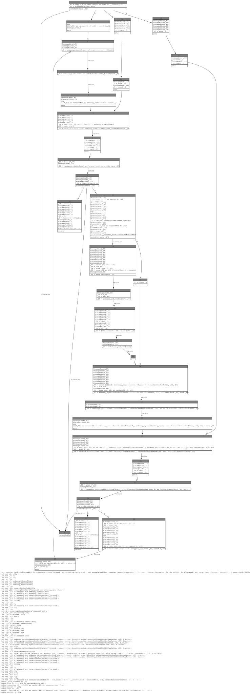
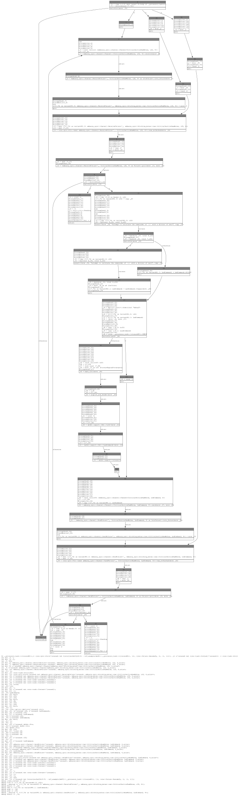
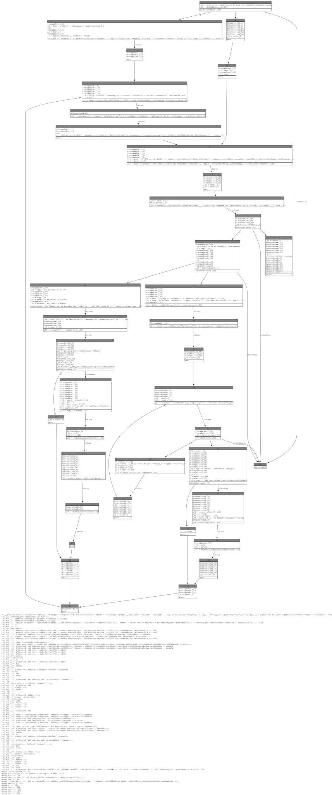

# How the Compiler Turns `async fn` into a State Machine

Each `async fn` in Rust is compiled into a **coroutine** — an enum whose
variants represent the suspend points (each `.await`).  The executor drives
the coroutine by calling its `poll()` method, which is essentially a
`match` on the current state.

## The `counter` task as an example

Source code:

```rust
async fn counter() {
    let mut tick: u32 = 0;
    loop {
        Timer::after_millis(500).await;   // ← suspend point 0
        info!("counter: tick {}", tick);
        TICK_CH.send(tick).await;         // ← suspend point 1
        tick = tick.wrapping_add(1);
    }
}
```

### Generated state enum (from MIR)

The compiler creates this layout (simplified):

```
                       ┌──────────────────────────────┐
                       │  counter coroutine (enum)     │
                       ├──────────────────────────────┤
                       │ variant 0: Unresumed   []    │  ← initial, never polled
                       │ variant 1: Returned    []    │  ← completed (never reached here)
                       │ variant 2: Panicked    []    │  ← panicked
                       │ variant 3: Suspend0  [tick, Timer]       │  ← yielded at Timer::await
                       │ variant 4: Suspend1  [tick, SendFuture]  │  ← yielded at send().await
                       └──────────────────────────────┘
```

Each variant only stores the variables that are **live across** that
particular `.await` — `tick` is live across both, but `Timer` and
`SendFuture` are never live at the same time, so they share storage.

### Generated `poll()` function (simplified from MIR)

```
fn poll(self: Pin<&mut Self>, cx: &mut Context) -> Poll<()> {
    match self.state {

        0 (Unresumed) ──► tick = 0
                          goto ──► create Timer ──► poll Timer ──┐
                                                                 │
        3 (Suspend0) ──► re-poll Timer ──┐                       │
                                         │                       │
                ┌────────────────────────┴───────────────────────┘
                │
                ├── Pending ──► save [tick, Timer] ──► state = 3 ──► return Pending
                │
                └── Ready ──► log tick
                              create SendFuture
                              poll SendFuture ──┐
                                                │
        4 (Suspend1) ──► re-poll SendFuture ──┐ │
                                              │ │
                ┌─────────────────────────────┴─┘
                │
                ├── Pending ──► save [tick, SendFuture] ──► state = 4 ──► return Pending
                │
                └── Ready ──► tick = tick.wrapping_add(1)
                              goto ──► loop back to create Timer
    }
}
```

Key observations:

- **Two `await`s → two suspend variants** (3 and 4). Each `.await`
  becomes a point where the function can yield `Pending` and later
  resume.
- **The loop disappears** — it becomes a `goto` from the end of
  Suspend1-Ready back to the Timer creation block.
- **No heap allocation** — the entire state (tick + whichever future is
  active) is stored inline in the enum. Embassy places this enum in a
  static task arena.

## MIR state machine graphs

The SVGs below are the **actual compiler output** (`-Z dump-mir-graphviz`)
for the `coroutine_resume` pass of each task.  Each box is a MIR basic
block; edges show control flow.  Look for the `switchInt` at `bb0` — that
is the top-level state dispatch.

### counter



### processor



### led_controller



## Reproducing

```bash
# Requires nightly + graphviz (apt install graphviz)
cargo +nightly rustc --release -- -Z dump-mir=all -Z dump-mir-graphviz

# Render to SVG
dot -Tsvg "mir_dump/nrf_example.__counter_task-{closure#0}.-------.coroutine_resume.0.dot" \
    -o docs/counter_state_machine.svg
dot -Tsvg "mir_dump/nrf_example.__processor_task-{closure#0}.-------.coroutine_resume.0.dot" \
    -o docs/processor_state_machine.svg
dot -Tsvg "mir_dump/nrf_example.__led_controller_task-{closure#0}.-------.coroutine_resume.0.dot" \
    -o docs/led_controller_state_machine.svg
```
